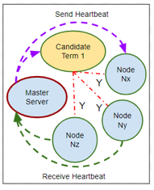
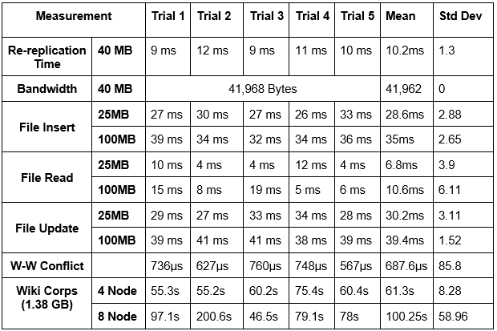

# Simple distributed file system
The distributed file system is designed to conduct basic file handling operations such as file write, read, delete and update. The system utilizes “Master Server” to handle the operations and the master is selected through the leader election process. In addition, the system can also tolerate multiple node failures without impacting file availability and file handling functionalities. It is designed such that every file is written onto 3 nodes asynchronous via an active replication process so as to maintain 3 replicas of the file in case of node failure. The put and read operation make use of Simple Write Quorum wherein R = W = 2. The failure detection mechanism is deployed such that every node sends and receives heartbeat messages from 2 successor and 2 predecessor nodes in a ring topology. 
**key-words**: fault-tolerance, distributed-system, consensus, heartbeat,raft, HDFS.

The project contains only one application folder namely **membershipsrc\msservice**. The instructions to compile and run the membership service can be found below: 

**Configuration**

There is a configuration file named config.json, in which there are some important settings which should be reconfigured
- LogPath: This is the folder storing all log files. It is "../mslogdb" by default.
- HeartbeatIntervalTimeInMilliseconds: the interval time between 2 heartbeats sent out from the node to its successor.
- HeartbeatTimeoutInMilliseconds: the maximum time a node waits for heartbeats from its predecessor before deciding that it has failed.
- GatewayNodes: addresses of 4 nodes playing gateway roles for welcoming new join. 

**Overall**
The source code is located on ..\fs533src\fs533app\. The high level design is depicted as on the image below

   

There are 2 sets of commands:
- Commands for membership
- Commands for file operations

**membership**

A group of nodes can join membership service, in which the one who starts the membership will play master role. Each membership is a replica server for FS533 file service. The system uses heartbeats to detect failures as illustrated on the image below.

   

There are 3 commands for membership service
1.	**Initialize a new group**
    When first node want to initialize a group, use following command
	
         go run command.go -i
    
    the 1st node must be one of the 4 gateway nodes, it is recommended to initialize group on the 1st gateway node

2. **Add for join an existing group**

    This command can be run on any node within a LAN network with the 1st node
	
         go run command.go
		 
3. **Leave an exiting group**

   After joining an existing group, type <c + enter> to see the available option, it would be leave or report
   
   - leave: type <leave + enter> to leave the group
   
   - report: type <report + enter> to report the current members list on the node
   
**FS33 file operations**
Fileoperation can be executed from a node playing member role or guest role. In order to start running application as a guest, run the following command

         go run command.go -i

To be notice that there are 3 important folders
- ..\localdb: this folder is to place all the local files
- ..\fs533db: this folder is to place all the replicated files
- ..\fs533log: this folder is to place all the log files

After the application is executed, type 'c' to see the guideline. The file operation commands are listed as below
		 
		 put <local_file> <fs533_file>
		 get <fs533_file> <local_file>		 
		 remove <fs533_file>
		 ls
		 locate <fs533_file>
		 lshere

**Testing**
This application was fully tested on AWS with up to 20 nodes with comprehensive unit tests. Additionally, the results of both the file handling operations and the unit test are written onto log files for tracking. Following measurements report shows the experiments of all operations against different file sizes of the system deployed on four AWS instances.

   
   

